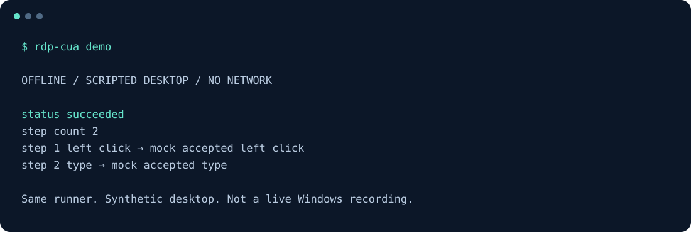
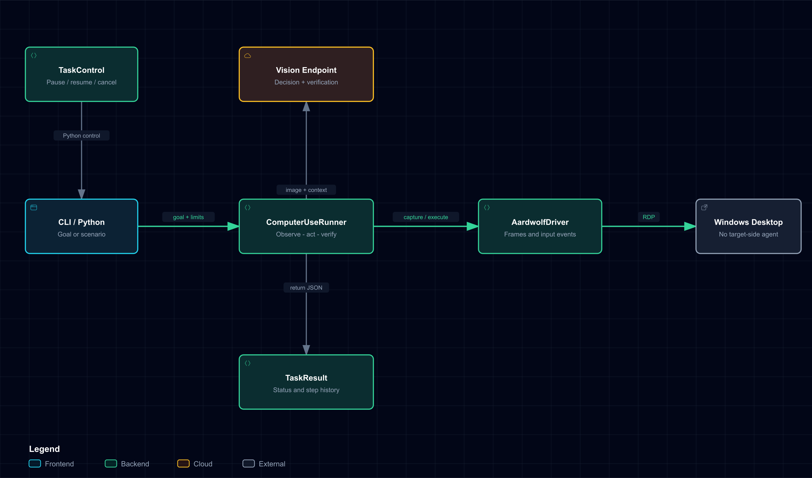

# RDP Computer-Use

**에이전트를 설치하기 어려운 Windows 데스크톱을 RDP로 자동화합니다.**

[](https://github.com/ttok9/rdp-computer-use/actions/workflows/ci.yml)

[English](README.md) · [MIT](LICENSE) · [빠른 시작](docs/QUICKSTART.md) · [테스트 기록](docs/TEST_REPORT.md)

[알파 다운로드](https://github.com/ttok9/rdp-computer-use/releases/tag/v0.2.0a2) · [작게 시작하는 기여](docs/FIRST_CONTRIBUTIONS.md)

**이미 RDP로 접속하는 PC는 있지만, 그 안에 자동화를 설치할 수 없을 때.**
이 프로젝트가 집중하는 문제입니다. API·CLI가 있는 작업은 해당 도구를 우선 사용하세요.

대상 PC에 자동화 에이전트를 설치하거나 CLI·애플리케이션 API를 사용할 수 없는 환경에서, 별도의 컨트롤러가 RDP 화면과 키보드·마우스 입력으로 Windows GUI를 제어합니다. GUI 검증 업무를 위한 작고 교체 가능한 핵심 런타임입니다. API가 있는 작업까지 GUI로 바꾸자는 프로젝트는 아닙니다.

> **알파 단계입니다.** Python 3.11/3.12 코어, Linux·macOS·Windows 어댑터, 패키징 등 [공개 CI 6개 작업이 통과](https://github.com/ttok9/rdp-computer-use/actions/runs/37777499061)했습니다. 어댑터 테스트는 모의 연결과 모델 응답을 사용합니다. 자세한 범위는 [테스트 기록](docs/TEST_REPORT.md)을 참고하세요.

## 서버 없이 시작하기

**RDP 서버·모델 키·Git 없이 실행할 수 있습니다.** Python 3.11 또는 3.12를 준비한 뒤 배포된 오프라인 데모를 실행하세요.

**macOS / Linux**

```bash
python3 -m venv .venv
.venv/bin/python -m pip install https://github.com/ttok9/rdp-computer-use/releases/download/v0.2.0a2/rdp_computer_use-0.2.0a2-py3-none-any.whl
.venv/bin/python -m rdp_cua demo
```

**Windows PowerShell**

```powershell
py -3.12 -m venv .venv
.\.venv\Scripts\python.exe -m pip install https://github.com/ttok9/rdp-computer-use/releases/download/v0.2.0a2/rdp_computer_use-0.2.0a2-py3-none-any.whl
.\.venv\Scripts\python.exe -m rdp_cua demo
```

Python 3.11만 설치했다면 `py -3.11`을 사용하세요. 가상환경을 직접 실행하므로 활성화 정책을 변경할 필요가 없습니다. [배포 파일·SHA-256 체크섬](https://github.com/ttok9/rdp-computer-use/releases/tag/v0.2.0a2).

<details>
<summary>소스를 수정하거나 실제 테스트 VM을 연결하려면</summary>

```bash
git clone https://github.com/ttok9/rdp-computer-use.git
cd rdp-computer-use
python -m venv .venv
source .venv/bin/activate
python -m pip install -e .
rdp-cua demo
```

Windows PowerShell에서는 활성화 명령을 `.venv\Scripts\Activate.ps1`로 바꿉니다.

</details>

데모는 실제 Windows나 AI가 아닌 **스크립트 기반 모의 데스크톱**으로 동일한 실행 루프를 검증합니다. 정상 실행 시 JSON에 `status: "succeeded"`와 2개 단계가 표시됩니다.



## 목적에 맞게 시작하기

| 목적 | 시작점 |
| --- | --- |
| 원리와 출력 확인 | `rdp-cua demo` |
| Windows 테스트 VM 연결 | [설치·설정 가이드](docs/QUICKSTART.md) |
| 작은 GUI 작업 시도 | [Notepad·Calculator 예제](docs/EXAMPLES.md) |
| 검증 재현 | `python tools/verify.py` |
| 모델·드라이버 확장 | [구조와 인터페이스](docs/ARCHITECTURE.md) |

실제 VM용 예제는 환경에 맞게 조정할 수 있는 시나리오 템플릿입니다.

## 실제 RDP 실행

```bash
python -m pip install -e '.[all]'
rdp-cua doctor --require-adapters
cp .env.example .env
```

`.env`에 접근 권한이 있는 테스트 VM과 이미지 입력을 지원하는 모델 엔드포인트를 설정합니다. PowerShell에서는 `Copy-Item .env.example .env`를 사용합니다.

```bash
rdp-cua smoke-rdp --env-file .env
rdp-cua scenario-check examples/scenarios/notepad.json
rdp-cua run --env-file .env --scenario examples/scenarios/notepad.json --output result.json
```

`smoke-rdp`는 로그인 후 화면을 받아 연결을 종료하며 마우스·키보드 입력은 보내지 않습니다. `run`은 실제 PC를 조작합니다. 시나리오는 모델 지침이며 각 단계를 강제로 실행·판정하는 정형 테스트 엔진은 아닙니다.

## 핵심 기능



- 관찰 → 판단 → 단일 행동 → 재관찰 → 검증 루프
- 드라이버·판단 모델·검증기 분리와 교체 가능한 Python 인터페이스
- 단계별 타임아웃, 최대 단계 수, 동일 행동 반복 제한
- Python API를 통한 일시정지·재개·취소
- 엄격한 행동/불리언 검증, 실제 화면 크기에 맞춘 좌표 변환
- JSON/Markdown 시나리오와 JSON 결과 기록
- 기본 실행 시 외부 런타임 의존성 없음; RDP·모델 SDK는 선택 설치

## 현재 상태와 주의점

**알파 버전입니다.** 위험 행동 승인 기능, 자동 재연결, 다중 모니터 지원은 구현되지 않았습니다. 격리된 테스트 VM과 최소 권한 계정을 사용하세요.

스크린샷과 행동 정보는 설정한 모델 서버로 전송됩니다. 결과 설명에도 민감한 내용이 포함될 수 있습니다. 모델의 성공 판정은 실제 검증 성공을 보장하지 않습니다. [보안 정책](SECURITY.md)을 먼저 확인하세요.

## 문서와 기여

[영문 README](README.md) · [구조 설명](docs/ARCHITECTURE.md) · [실행 흐름도](docs/visualizations/control-loop.sequence.html) · [로드맵](docs/ROADMAP.md) · [기여 가이드](CONTRIBUTING.md)

도움이 된다면 Star로 알려주세요. 실제 테스트 환경의 재현 가능한 결과와 민감정보를 제거한 오류 사례가 특히 도움이 됩니다.

[첫 기여 작업 3가지](docs/FIRST_CONTRIBUTIONS.md)에서 Windows VM 없이 시작할 수 있는 문서 검증도 확인할 수 있습니다. [재현 가능한 문제 신고](https://github.com/ttok9/rdp-computer-use/issues/new?template=bug_report.yml) · [사용 사례 제안](https://github.com/ttok9/rdp-computer-use/issues/new?template=feature_request.yml).

[공개·데모 준비 가이드](docs/LAUNCH_PLAYBOOK.md)에는 인기 오픈소스의 구성에서
참고한 점, 참고 저장소, 실제 데모 촬영 순서, 성능을 과장하지 않는 평가 방법을 정리했습니다.

## 라이선스

이 프로젝트 코드는 MIT로 제공합니다. `aardwolf` 등 타인의 코드가 이 프로젝트의 독점 소유가 되는 것은 아니며, 원저작권과 라이선스 고지를 유지합니다. 배포판은 공개 upstream `aardwolf==0.2.13`을 의존성으로 사용하고 비공개 수정본은 포함하지 않습니다. [제3자 고지](THIRD_PARTY_NOTICES.md).
