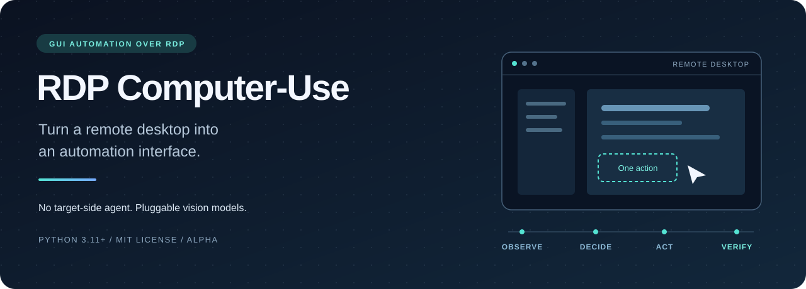
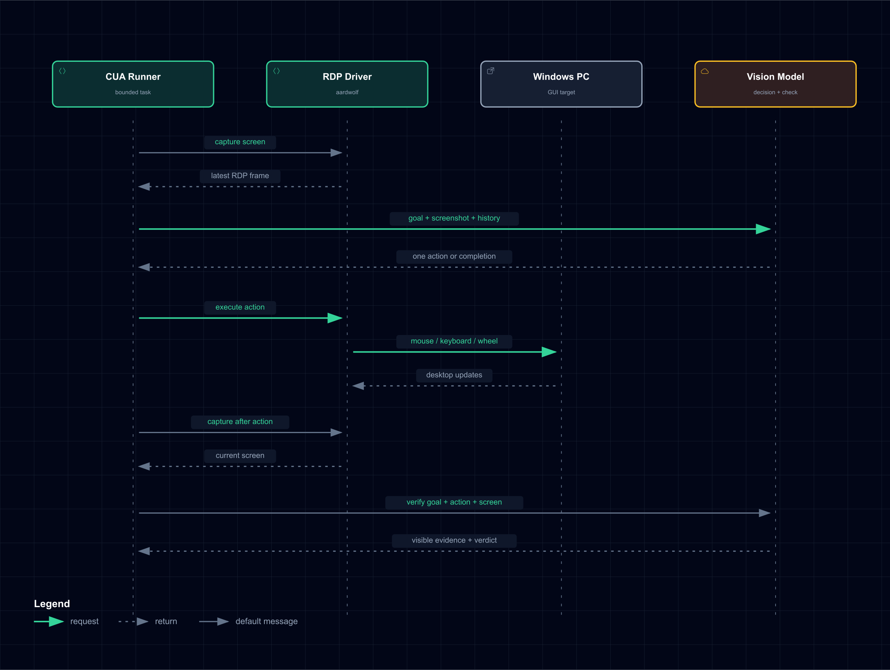

<p align="center"></p>

<p align="center"><strong>See the screen. Take one action. Check what changed.</strong><br>GUI-only Windows automation over RDP, with pluggable vision-language models.</p>

<p align="center"><a href="LICENSE">MIT licensed</a> · Python 3.11+ · Alpha · <a href="README.ko.md">한국어</a></p>

<p align="center"><a href="#try-the-loop-without-a-server">Quick start</a> · <a href="docs/EXAMPLES.md">Examples</a> · <a href="docs/ARCHITECTURE.md">Architecture</a> · <a href="docs/TEST_REPORT.md">Verification</a> · <a href="CONTRIBUTING.md">Contribute</a></p>

Automate a Windows test machine even when you cannot install an agent, use a shell, or call the application's API. RDP Computer-Use runs on a separate controller: it reads desktop frames, asks a vision model for the next action, sends mouse/keyboard input over RDP, and checks the resulting screen.

**Built for GUI validation workflows.** A small, inspectable core—not a replacement for reliable APIs or deterministic test assertions when those are available.

**The niche: you already have an RDP desktop, but cannot put automation inside it.** Keep the target as it is. Bring a controller and an image-capable model endpoint.

> **Alpha, not production-ready.** Local tests cover the runner and adapter contracts with fakes. A real Windows + vision-model end-to-end pass has **not** been established for this release. There is no destructive-action approval gate. Use a disposable VM and read the [security boundaries](SECURITY.md).

## Try the loop without a server

Download/clone this repository, open its root directory, and use Python 3.11 or 3.12:

```bash
python -m venv .venv
source .venv/bin/activate
python -m pip install -e .
rdp-cua demo
```

On Windows PowerShell, replace the activation command with `.venv\Scripts\Activate.ps1`.

The demo uses a **scripted, in-memory desktop**, not a real model or RDP connection. It exercises the same runner and returns JSON with `status: "succeeded"` and two recorded steps. The base package has no runtime dependencies.


This card is generated from `rdp-cua demo` output, not a simulated live-Windows success claim. [Full JSON result](examples/demo-result.json) · [Reproduce the card](tools/render_demo.py).

## Choose your path

| You want to… | Start here | Needs |
| --- | --- | --- |
| Understand the loop | `rdp-cua demo` | Python only |
| Connect a Windows lab | [RDP setup](docs/QUICKSTART.md) | Reachable RDP + authorized test account |
| Try a visual task | [Notepad / Calculator recipes](docs/EXAMPLES.md) | RDP + compatible vision endpoint |
| Plug in your own model or transport | [Python contracts](src/rdp_cua/protocols.py) | Your adapter implementation |
| Reproduce local checks | `python tools/verify.py` | Installed package; SDKs optional |

## When to use it—and when not to

Choose this project for **RDP-only GUI experiments**, legacy desktop validation,
or research into visual verification. Prefer direct APIs/CLI for structured,
deterministic work when available; prefer browser tooling for browser-only tasks.
This alpha is not a production RPA suite, a hosted desktop fleet, or a benchmark-winning agent.

## Why this project?

| Need | What the core provides |
| --- | --- |
| A desktop with no usable application API | RDP screenshots and normal mouse/keyboard events |
| A loop you can inspect and replace | Separate driver, decision-engine, and verifier protocols |
| Bounded experiments | Step limits, stage timeouts, repeated-action detection, cooperative cancellation |
| Portable task descriptions | JSON/Markdown scenarios as model guidance |
| Development without a Windows lab | Offline demo and deterministic regression tests |

The target still needs enabled, reachable RDP, an authorized account, and a GUI session. “Agentless” means **no additional automation agent on that target**; the controller and vision endpoint still need dependencies.

## Architecture


[Architecture notes](docs/ARCHITECTURE.md) · [Interactive Archify viewer](docs/visualizations/release.architecture.html) · [Diagram source](docs/visualizations/release.architecture.json)

GitHub shows HTML as source. Download the repository and open the viewer locally for themes, zoom, exploration, and export. Diagrams are in English.

## Connect a disposable Windows VM

```bash
python -m pip install -e '.[all]'
rdp-cua doctor --require-adapters
cp .env.example .env
```

On PowerShell use `Copy-Item .env.example .env`. Edit `.env` locally with your RDP account and image-capable, OpenAI-compatible Chat Completions endpoint. Do not commit it.

```bash
# Connect and receive a frame. Sends no mouse/keyboard input.
rdp-cua smoke-rdp --env-file .env

# Validate a scenario without making network calls.
rdp-cua scenario-check examples/scenarios/notepad.json

# This command DOES control the target desktop.
rdp-cua run --env-file .env \
  --scenario examples/scenarios/notepad.json --output result.json
```

`--output` refuses to overwrite an existing file. Use a fresh filename for each run. Scenarios provide instructions and expected conditions to the model; they are **not** a deterministic step-by-step test executor. See [setup and configuration](docs/QUICKSTART.md).

## Observe → decide → act → verify



After each executed action, the runner captures another frame and asks the verifier what happened. Decisions and verification results use strictly validated JSON booleans and action fields. Failed verification does not clear the repeated-action guard.

Supported actions: `left_click`, `right_click`, `double_click`, `type`, `key`, `scroll`, `wait`. Click coordinates use an integer 0–1000 space mapped to the actual received frame dimensions. [Interactive sequence diagram](docs/visualizations/control-loop.sequence.html).

## Extend it in Python

```python
from rdp_cua import ComputerUseRunner, RunnerConfig, TaskControl

async def run_task(driver, decision_engine, verifier):
    control = TaskControl()
    runner = ComputerUseRunner(
        driver, decision_engine, verifier,
        RunnerConfig(max_steps=20, model_timeout_seconds=60),
    )
    # Your UI can call control.pause(), resume(), or cancel()
    # from this same event loop while run() is active.
    return await runner.run("Open Notepad and type a public test message", control)
```

Implement [`DesktopDriver`, `DecisionEngine`, or `Verifier`](src/rdp_cua/protocols.py) to swap transport or model. Your integration owns connection/client cleanup; the CLI manages it for built-in adapters. Pause takes effect at stage boundaries; cancellation cannot undo an already transmitted input.

## Development and evidence

```bash
python -m pip install -e '.[all,dev]'
python -m unittest discover -s tests -v
python tools/verify.py --require-adapters
python -m build
```

[Test report](docs/TEST_REPORT.md) · [Contributing](CONTRIBUTING.md) · [Roadmap](docs/ROADMAP.md) · [Changelog](CHANGELOG.md)

GitHub Actions is configured for base tests, optional adapters, and package checks; it has not been executed on a public repository yet. There are no claimed benchmark scores, savings, or real-task success rates.

## Boundaries worth knowing

- Screenshots, task text, history, and action parameters are sent to the configured model endpoint. Choose that endpoint deliberately.
- Model judgments are fallible. A reported success is not independent proof of correctness.
- JSON traces omit raw screenshots and typed action fields, but model-generated reasons can still reveal sensitive content. Review before sharing.
- Prompt instructions and shape validation are not a security sandbox. No human approval, semantic action policy, or verified RDP certificate-pinning control is exposed by this alpha.
- No automatic reconnect, multi-monitor workflow, or guarantee of Unicode/IME behavior. Use a single test display and verify your keyboard/layout.
- Teams, the original web UI, and organization-specific integrations are intentionally outside this public core.

## Help shape the next release

The most useful contributions are reproducible Windows smoke results, redacted failure cases, stronger independent verification, and new adapters.

| First contribution | What a useful PR/report contains |
| --- | --- |
| A Windows compatibility report | OS/Python/model/display setup, exact commands, and redacted outcome |
| An adapter regression | A small synthetic test that fails before the fix |
| An independent verifier | A concrete success/failure contract plus limitations |
| A setup clarification | The failing command, environment, and corrected instructions |

Read the [contributor guide](CONTRIBUTING.md). If this solves a problem you have,
**star the project to follow its progress**. Try one harmless scenario, report what
broke, and help make the next release reproducible.

## FAQ

**Do I install anything on the Windows target?** No additional automation agent.
RDP must already be enabled and permitted. Python runs on the controller.

**Which model should I use?** An image-capable endpoint supporting the adapter's
Chat Completions request and JSON contract. There is no validated model ranking yet.

**Does it work without cloud inference?** You can configure a local compatible
endpoint. This does not make the task offline unless both that endpoint and your
RDP target are reachable locally and the model is already available.

**Is a green result proof that my application passed validation?** No. The built-in
verifier is model-based. Add an independent verifier for hard acceptance criteria.

## License and credits

Project code is under the [MIT License](LICENSE). RDP transport uses [aardwolf](https://github.com/skelsec/aardwolf); the vision adapter uses the OpenAI Python SDK; diagrams are generated with [Archify](https://github.com/tt-a1i/archify). Their licenses remain separate—see [third-party notices](THIRD_PARTY_NOTICES.md). This release depends on upstream `aardwolf==0.2.13`; it does not bundle or claim ownership of a private modified fork.
